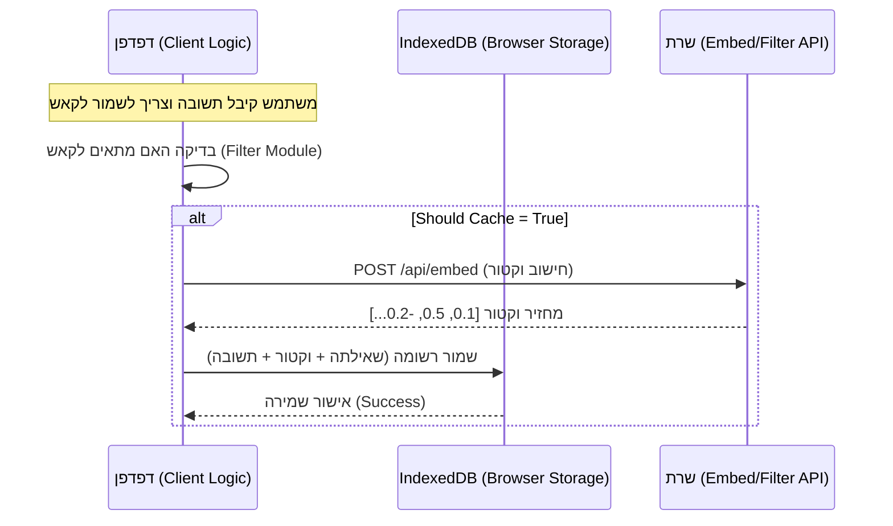

# ארכיטקטורת הקאש (Caching Architecture) - הסבר טכני

מסמך זה מתאר כיצד מיושם מנגנון הקאש בפרויקט הנוכחי, היכן נשמר המידע, ומה קורה "מאחורי הקלעים" בעת הוספת ערך חדש לקאש.

## 1. המיקום הפיזי של הנתונים (Storage Strategy)

בארכיטקטורה הנוכחית, **הקאש נשמר בצד הלקוח (Client-Side)**, כלומר בדפדפן של המשתמש, ולא בשרת מרכזי.

*   **טכנולוגיה:** `IndexedDB`
*   **ספרייה בשימוש:** `idb` (עטיפה נוחה מעל ה-API של הדפדפן)
*   **שם בסיס הנתונים:** `dell-compact-db`
*   **טבלה (Object Store):** `cache`

**משמעות:** כל משתמש מחזיק עותק מקומי של הקאש שלו. השרת משמש רק כאינסטרומנט לחישובים כבדים (Embeddings / LLM), אך אינו שומר את ה-State של השיחות או הקאש.

---

## 2. תהליך הוספה לקאש (Data Flow)

כאשר הפונקציה `addToCache` נקראת (למשל, אחרי שתשובה סופית התקבלה מה-LLM ועברה את הפילטר), מתרחש התהליך הבא:

### שלב א': יצירת ייצוג וקטורי (Embedding)
כדי לאפשר חיפוש סמנטי ("חכם") בעתיד, המערכת צריכה להפוך את הטקסט של השאילתה למספרים (וקטור).

1.  הלקוח קורא לפונקציה `embedText(query)`.
2.  **קריאת שרת:** נשלחת בקשת `POST /api/embed` לשרת המקומי (Express).
    *   השרת משתמש במודל (למשל `all-MiniLM-L6-v2`) ומחזיר מערך מספרים (למשל 384 מימדים).
3.  **Fallback:** אם השרת לא זמין, הלקוח מפעיל אלגוריתם מתמטי מקומי (פשוט יותר) ליצירת וקטור, כדי שהמערכת תמשיך לעבוד.

### שלב ב': שמירה במסד הנתונים המקומי
לאחר שיש לנו את הווקטור ואת התשובה מה-LLM:

1.  הלקוח פונה ל-`indexedDB` המקומי.
2.  נשמרת רשומה חדשה בטבלת `cache` המכילה:
    *   `projectId`: המזהה של הפרויקט (כדי להפריד בין הקשרים).
    *   `queryText`: השאילתה המקורית (טקסט).
    *   `embedding`: הווקטור שחושב בשלב א' (מערך מספרים).
    *   `llmResponse`: התשובה שקיבלנו (הטקסט שנציג בעתיד).
    *   `metadata`: אופציונלי (טוקנים, זמן ריצה וכו').

---

## 3. סיכום ויזואלי

## 4. איפה הקוד נמצא?

1.  **ממשק השמירה:** `src/lib/cache.ts` -> הפונקציה `addToCache`.
2.  **ניהול ה-DB:** `src/lib/storage/db.ts` -> הגדרת הסכמה והפעולות מול IndexedDB.
3.  **חישוב הוקטור:** `src/lib/embedApi.ts` והשרת ב-`server/index.js`.
