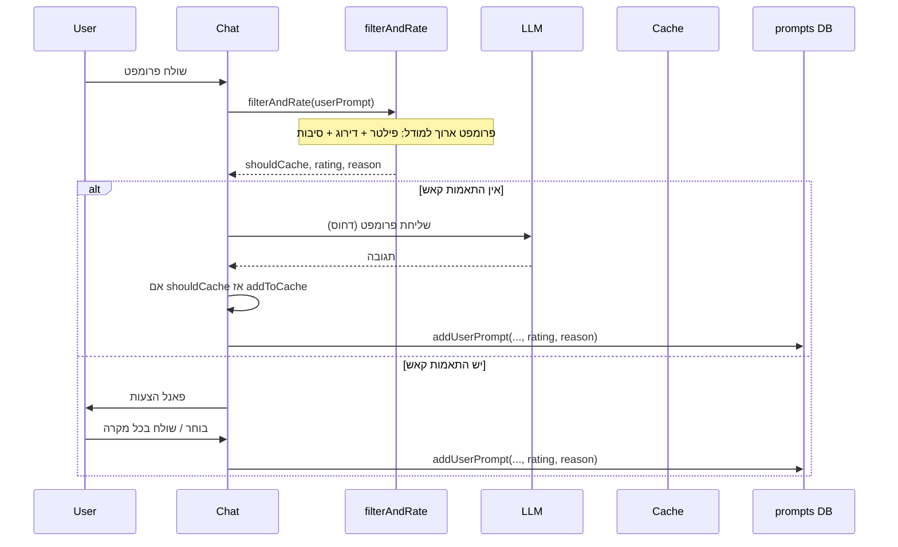

# Filter and Rating for Caching — תוכנית מימוש

## מצב קיים

- **[Chat.tsx](src/pages/Chat.tsx)**: אחרי תגובת ה-LLM תמיד קוראים ל-`addToCache` ואז ל-`addUserPrompt`. אין פילטר לפי סוג הפרומפט.
- **[userStore.ts](src/lib/userStore.ts)**: `addUserPrompt` קורא ל-`ratePrompt(queryText)` (מוק דטרמיניסטי מ-[mockLLM.ts](src/lib/mockLLM.ts)) ושומר `rating` + `ratingReason` ב-DB.
- **[db.ts](src/lib/storage/db.ts)**: טבלת `prompts` כוללת `rating`, `ratingReason`; אין שדה "cacheEligible".
- **שרת**: [server/index.js](server/index.js) — רק `/api/embed` ו-`/api/health`. אין עדיין endpoint למודל שפה.

## ארכיטקטורה רצויה

- **פילטר**: `shouldCache === true` רק לפרומפטים שהם "שאלת מידע / חקירה / הסבר"; אם הפרומפט הוא הוראה לביצוע ("עשה X בקוד") – `shouldCache === false`.
- **דירוג**: 1–10 לפי כמות רעש, סגנון הבקשה, פירוט; המודל מחזיר גם **סיבת הדירוג** (טקסט).
- **פלט**: שלישייה `(rating: number, reason: string, shouldCache: boolean)`.

---

## 1. מודול Filter + Rating — `filterAndRatePrompt`

**קובץ חדש (או הרחבה של mockLLM):** למשל `src/lib/filterAndRating.ts`.

- **חתימה:**
  - `filterAndRatePrompt(userPrompt: string): Promise<{ shouldCache: boolean; rating: number; reason: string }>`
- **לוגיקה:**
  - **אם יש backend**: `POST /api/filter-and-rate` עם body `{ prompt: userPrompt }`. השרת שולח למודל שפה פנימי (למשל Hugging Face Inference) **פרומפט מערכת ארוך** שמסביר:
    - פילטר: "האם זו שאלת מידע/הסבר/חקירה (כן) או הוראה לביצוע/קוד (לא)? החזר JSON: shouldCache."
    - דירוג: "דרג 1–10 לפי: רעש לא רלוונטי, סגנון הבקשה, פירוט. החזר rating ו-reason."
  - **אם אין backend / כישלון**: Fallback בקליינט:
    - פילטר: היוריסטיקה פשוטה (למשל ביטויים כמו "write code", "implement", "בקוד", "תעשה" → `shouldCache = false`).
    - דירוג: שימוש ב-`ratePrompt` הקיים מ-[mockLLM.ts](src/lib/mockLLM.ts) עבור `rating` ו-`reason`.
- **פורמט תשובה מהשרת:** JSON קבוע, למשל:  
`{ "shouldCache": boolean, "rating": number, "reason": string }`  
כדי שהקליינט יוכל לפרסר בלי תלות בפורמט חופשי.

---

## 2. אינטגרציה ב-Chat — מתי קוראים ומה עושים עם התוצאה

**קובץ:** [src/pages/Chat.tsx](src/pages/Chat.tsx).

- **מתי לקרוא ל-`filterAndRatePrompt`:**
  - בתחילת `handleSend` (אחרי הוספת הודעת המשתמש ל-state): להריץ `filterAndRatePrompt(query)` **במקביל** ל-`findTopCacheMatches(session.projectName, query)` (למשל `Promise.all`), כדי שבסיום יש גם התאמות קאש וגם `{ shouldCache, rating, reason }`.
- אם יש התאמות קאש – לשמור את תוצאת הפילטר/דירוג ב-state של פאנל ההצעות (למשל בתוך האובייקט שכבר מכיל `query`, `matches`, `queryVector`), כדי שאם המשתמש לוחץ "Send to LLM anyway" נשתמש באותה תוצאה (בלי קריאה חוזרת).
- **שימוש בתוצאה:**
  - **כשנשלח ל-LLM** (`handleSendToLLM`):
    - רק אם `filterResult.shouldCache === true` לקרוא ל-`addToCache(...)` (אותו חתימה כמו היום).
    - תמיד לקרוא ל-`addUserPrompt` עם הדירוג והסיבה מהמודל: להעביר `filterResult.rating` ו-`filterResult.reason` (ראו סעיף 3).
  - **כשמשתמש בוחר התאמת קאש** (`handlePickSuggestion`): גם כאן לשמור היסטוריה עם דירוג — לקרוא ל-`addUserPrompt` עם אותו `rating` ו-`reason` (כבר חישבנו ב-`handleSend` ושמרנו ב-state של ההצעות).
- **קצה "Send anyway":** אם יש `filterResult` ב-state של ההצעות – להעביר אותו ל-`handleSendToLLM` (או לקרוא שוב ל-`filterAndRatePrompt` רק אם אין תוצאה שמורה; עדיף שימוש חוזר כדי לא להכפיל קריאות).

---

## 3. עדכון `addUserPrompt` — דירוג וסיבה מהפילטר

**קובץ:** [src/lib/userStore.ts](src/lib/userStore.ts).

- **חתימה מעודכנת:**  
`addUserPrompt(employeeId, projectId, queryText, cached, rating?, ratingReason?)`  
(או אובייקט אופציונלי `{ rating?, ratingReason? }` אם מעדיפים).
- **לוגיקה:**
  - אם הועברו `rating` ו-`ratingReason` (מהפילטר/דירוג) — להשתמש בהם.
  - אחרת — fallback ל-`ratePrompt(queryText)` כמו היום (תאימות לאחור).
- כך כל הקריאות ל-`addUserPrompt` מהצ'אט יעברו את הערכים מ-`filterAndRatePrompt` כשהם זמינים.

---

## 4. שרת — endpoint למודל שפה פנימי

**קובץ:** [server/index.js](server/index.js) (או קובץ route נפרד אם תרצו להרחיב).

- **Endpoint חדש:** `POST /api/filter-and-rate`
  - Body: `{ "prompt": string }`.
  - השרת בונה **פרומפט מערכת ארוך** (טקסט קבוע) שמסביר:
    - תפקיד 1: לקבוע אם הפרומפט מתאים לקאש (שאלת מידע/הסבר/חקירה = כן; הוראה לביצוע/קוד = לא).
    - תפקיד 2: לדרג 1–10 לפי רעש, סגנון, פירוט, ולתת סיבה טקסטואלית.
  - השרת שולח למודל שפה פנימי (למשל Hugging Face Inference API עם מודל קטן שתומך ב-JSON, או OpenAI-compatible) את פרומפט המערכת + הפרומפט של המשתמש, ומבקש תשובה ב-JSON בפורמט:  
  `{ "shouldCache": boolean, "rating": number, "reason": string }`.
  - השרת מחזיר את ה-JSON הזה ללקוח (עם טיפול בשגיאות ו-validation בסיסי).
- **משתני סביבה:** אם צריך מפתח/URL למודל (למשל `HUGGINGFACEHUB_API_KEY` או `FILTER_RATE_MODEL`) — להוסיף ל-`.env` ולתיעוד.

---

## 5. קליינט — קריאה ל-API ו-Fallback

**במודול filterAndRating:**

- קריאה ל-`POST /api/filter-and-rate` (אותו base כמו embedding, למשל `VITE_EMBED_API_URL` או משתנה ייעודי).
- על timeout או שגיאה: Fallback כמתואר בסעיף 1 (היוריסטיקת פילטר + `ratePrompt` לדירוג).

---

## 6. סכמת נתונים (אופציונלי להצגה ואנליטיקה)

- **prompts (IndexedDB):** כבר קיימים `rating`, `ratingReason`. אופציונלי: להוסיף שדה `cacheEligible?: boolean` (מהפילטר) כדי לאפשר בדשבורד "כמה פרומפטים אושרו לקאש". דורש מיגרציית גרסה ב-[db.ts](src/lib/storage/db.ts) אם בוחרים בכך.
- **Cache:** אין שינוי בסכמה — פשוט לא קוראים ל-`addToCache` כאשר `shouldCache === false`.

---

## 7. סיכום קבצים

| קובץ                                           | שינוי                                                                                                                                                                                                                                                                                  |
| ---------------------------------------------- | -------------------------------------------------------------------------------------------------------------------------------------------------------------------------------------------------------------------------------------------------------------------------------------- |
| **חדש:** `src/lib/filterAndRating.ts`          | `filterAndRatePrompt(userPrompt)` — קריאה ל-API + fallback (היוריסטיקת פילטר + `ratePrompt`).                                                                                                                                                                                          |
| [src/pages/Chat.tsx](src/pages/Chat.tsx)       | ב-`handleSend`: הרצת `filterAndRatePrompt` במקביל ל-`findTopCacheMatches`; שמירת תוצאה ב-state של ההצעות; ב-`handleSendToLLM`: `addToCache` רק אם `shouldCache`, העברת `rating`/`reason` ל-`addUserPrompt`; ב-`handlePickSuggestion`: `addUserPrompt` עם rating/reason מהתוצאה השמורה. |
| [src/lib/userStore.ts](src/lib/userStore.ts)   | הרחבת `addUserPrompt` לקבל `rating?`, `ratingReason?`; שימוש ב-`ratePrompt` רק כ-fallback.                                                                                                                                                                                             |
| [server/index.js](server/index.js)             | הוספת `POST /api/filter-and-rate`: פרומפט מערכת ארוך, קריאה למודל שפה, החזרת JSON `{ shouldCache, rating, reason }`.                                                                                                                                                                   |
| [src/lib/storage/db.ts](src/lib/storage/db.ts) | אופציונלי: מיגרציה להוספת `cacheEligible` ל-prompts.                                                                                                                                                                                                                                   |

---

## 8. תוכן פרומפט המערכת (רעיון לשרת)

פרומפט מערכת לדוגמה (בעברית/אנגלית לפי הצורך):

- "You are a classifier and rater for user prompts. Given a user prompt: (1) Decide if it is suitable for caching: answer true only for information-seeking, explanation, or exploration questions; answer false for instructions, code requests, or 'do X' tasks. (2) Rate the prompt quality 1–10 based on: amount of irrelevant noise, clarity of request, and level of detail. (3) Provide a short reason for the rating. Respond with JSON only: { shouldCache: boolean, rating: number, reason: string }."

ניתן להתאים את הטקסט לסגנון הפרויקט ולהוסיף דוגמאות בפרומפט אם המודל דורש.

---

לאחר אישור התוכנית אפשר לעבור למימוש צעד-אחר-צעד (מודול filterAndRating, שרת, אינטגרציה ב-Chat ו-userStore).